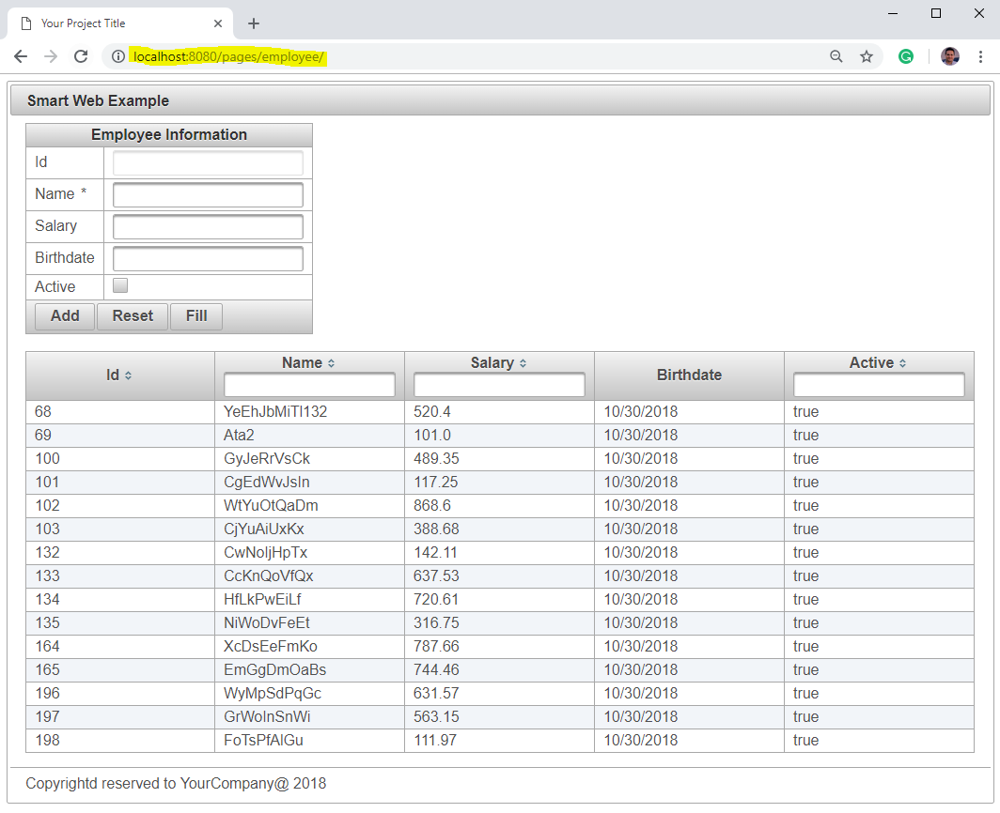

IMPORTANT: All my repositories are currently under extensive development and refactoring due to working on my Ph.D dissertation. Please come back later for more enhanced documentation and tutorials.  
Thanks!   

*Jalal*

= Smart-Web
An End-End framework for building your next web-project

== Full Example   

The below steps will take you throw a full example of Smart-Web. The final appliaction will produce the output shown in this screenshot:

NOTE: No database installation or configuration required, since H2 is used by default, and the structure will be dynamically built for you. 

=== Maven `pom.xml`
[source, xml]
----
<project xmlns="http://maven.apache.org/POM/4.0.0" xmlns:xsi="http://www.w3.org/2001/XMLSchema-instance"
	xsi:schemaLocation="http://maven.apache.org/POM/4.0.0 http://maven.apache.org/xsd/maven-4.0.0.xsd">
	<modelVersion>4.0.0</modelVersion>
	<groupId>com.jalalkiswani</groupId>
	<version>0.0.1-SNAPSHOT</version>
	<artifactId>jk-smart-web-example</artifactId>
	<packaging>war</packaging>

	<dependencies>
		<dependency>
			<groupId>com.jalalkiswani</groupId>
			<artifactId>jk-smart-web</artifactId>
			<version>1.0.1-BETA-2-SNAPSHOT</version>
		</dependency>
	</dependencies>
	<build>
		<finalName>app</finalName>
		<plugins>
			<plugin>
				<groupId>org.apache.maven.plugins</groupId>
				<artifactId>maven-compiler-plugin</artifactId>
				<version>3.3</version>
				<configuration>
					<!-- http://maven.apache.org/plugins/maven-compiler-plugin/ -->
					<source>1.8</source>
					<target>1.8</target>
				</configuration>
			</plugin>

			<plugin>
				<groupId>org.apache.maven.plugins</groupId>
				<artifactId>maven-war-plugin</artifactId>
				<configuration>
					<failOnMissingWebXml>false</failOnMissingWebXml>
				</configuration>
			</plugin>
		</plugins>
	</build>

	<profiles>
		<profile>
			<id>allow-snapshots</id>
			<activation>
				<activeByDefault>true</activeByDefault>
			</activation>
			<repositories>
				<repository>
					<id>snapshots-repo</id>
					<url>https://oss.sonatype.org/content/repositories/snapshots</url>
					<releases>
						<enabled>false</enabled>
					</releases>
					<snapshots>
						<enabled>true</enabled>
					</snapshots>
				</repository>
			</repositories>
		</profile>
	</profiles>
</project>
----
	 
=== Model (bean) 
src/main/java/com/jk/web/example/model/Employee.java

[source, java]
----
package com.jk.web.example.model;

import java.util.Date;

public class Employee {
	Integer id;
	String name;
	Double salary;
	Date birthdate;
	Boolean active;

	public Integer getId() {
		return id;
	}

	public void setId(Integer id) {
		this.id = id;
	}

	public String getName() {
		return name;
	}

	public void setName(String name) {
		this.name = name;
	}

	public Double getSalary() {
		return salary;
	}

	public void setSalary(Double salary) {
		this.salary = salary;
	}

	public Date getBirthdate() {
		return birthdate;
	}

	public void setBirthdate(Date birthdate) {
		this.birthdate = birthdate;
	}

	public Boolean getActive() {
		return active;
	}

	public void setActive(Boolean active) {
		this.active = active;
	}

}
----

=== Controller (Managed bean)
src/main/java/com/jk/web/example/controller/MB_Employee.java

[source, java]
----
package com.jk.web.example.controller;

import javax.faces.bean.ManagedBean;
import javax.faces.bean.ViewScoped;

import com.jk.web.example.model.Employee;
import com.jk.web.faces.mb.JKDataAccessManagedBean;

@ManagedBean(name = "mb")
@ViewScoped
public class MB_Employee extends JKDataAccessManagedBean<Employee> {

}
----

=== Facelet template (common to all pages)
src/main/webapp/WEB-INF/templates/default.xhtml

[source, html]
----
<!DOCTYPE html>
<html lang="en" xmlns="http://www.w3.org/1999/html" xmlns:ui="http://xmlns.jcp.org/jsf/facelets" xmlns:h="http://xmlns.jcp.org/jsf/html" xmlns:f="http://xmlns.jcp.org/jsf/core"
	xmlns:p="http://primefaces.org/ui">
<h:head>
	<f:facet name="first">
		<title>Your Project Title</title>
		<meta charset="UTF-8" />
		<meta name="viewport" content="width=device-width, initial-scale=1.0" />
		<link rel="shortcut icon" type="image/x-icon" href="#{request.contextPath}/theme/favicon.ico" />
	</f:facet>
	<link rel="stylesheet" href="#{request.requestURI}style.css?reload=#{util.reloadRandom()}" type="text/css" media="all" />
	<script src="#{request.requestURI}script.js?reload=#{util.reloadRandom()}" />
</h:head>
<h:body>
	<p:panel>
		<f:facet name="header">
			Smart Web Example
		</f:facet>
		<ui:insert name="contents">main-contents-goes here</ui:insert>
		<f:facet name="footer">
			

				Copyrightd reserved to YourCompany@ #{util.currentYear()}
			

		</f:facet>
	</p:panel>
</h:body>

</html>

----

=== View (Page)
src/main/webapp/pages/employee/index.xhtml

[source, html]
----
<!DOCTYPE html>
<html xmlns="http://www.w3.org/1999/xhtml" xmlns:h="http://java.sun.com/jsf/html" xmlns:jk="http://jalalkiswani.com/jsf" xmlns:p="http://primefaces.org/ui" xmlns:ui="http://xmlns.jcp.org/jsf/facelets"
	xmlns:c="http://xmlns.jcp.org/jsp/jstl/core" xmlns:f="http://xmlns.jcp.org/jsf/core">
<ui:composition template="/WEB-INF/templates/default.xhtml">
	<ui:define name="contents">
		<h:form>
			<p:panelGrid columns="2" id="model" style="margin:auto">
				<f:facet name="header">Employee Information</f:facet>
				<p:outputLabel value="#{msg.get('Id')}" for="id" />
				<p:inputText value="#{mb.model.id}" id="id" disabled="#{true}" />

				<p:outputLabel value="#{msg.get('name')}" for="name" />
				<p:inputText value="#{mb.model.name}" id="name" required="true" disabled="#{mb.readOnlyMode}" />

				<p:outputLabel value="#{msg.get('salary')}" for="salary" />
				<p:inputText value="#{mb.model.salary}" id="salary" disabled="#{mb.readOnlyMode}" />

				<p:outputLabel value="#{msg.get('birthdate')}" for="birthdate" />
				<p:calendar value="#{mb.model.birthdate}" id="birthdate" disabled="#{mb.readOnlyMode}" pattern="MM/dd/yyyy"/>

				<p:outputLabel value="#{msg.get('active')}" for="active" />
				<p:selectBooleanCheckbox value="#{mb.model.active}" id="active" disabled="#{mb.readOnlyMode}" />

				<f:facet name="footer">
					

						<p:commandButton value="#{msg.get('Add')}" action="#{mb.add}" rendered="#{mb.allowAdd}" update="@form" process="model" />
						<p:commandButton value="#{msg.get('Edit')}" action="#{mb.edit}" process="@this" rendered="#{mb.allowEdit}" update="@form" />
						<p:commandButton value="#{msg.get('Save')}" action="#{mb.save}" rendered="#{mb.allowSave}" update="@form" process="model" />
						<p:commandButton value="#{msg.get('Delete')}" action="#{mb.delete}" process="@this" rendered="#{mb.allowDelete}" update="@form" />
						<p:commandButton value="#{msg.get('Reset')}" action="#{mb.reset}" process="@this" rendered="#{mb.allowReset}" update="@form" />
						<p:commandButton value="#{msg.get('Fill')}" action="#{mb.fill}" process="@this" rendered="#{mb.allowFill}" update="@form" />
						<p:commandButton value="#{msg.get('Cancel Edit')}" action="#{mb.cancelEdit}" process="@this" rendered="#{mb.editMode}" update="@form" />
					

				</f:facet>
			</p:panelGrid>
			<p:messages />
			 
			<p:dataTable value="#{mb.modelList}" var="model" paginator="true" paginatorAlwaysVisible="false" paginatorPosition="bottom" selectionMode="single" selection="#{mb.model}" rowKey="#{model.id}">
				<p:ajax event="rowSelect" update="@form:model" />
				<p:column headerText="#{msg.get('Id')}" filterable="#{model.id}" sortBy="#{model.id}">	
					#{model.id}
				</p:column>
				<p:column headerText="#{msg.get('name')}" filterBy="#{model.name}" sortBy="#{model.name}">	
					#{model.name}
				</p:column>
				<p:column headerText="#{msg.get('salary')}" filterBy="#{model.salary}" sortBy="#{model.salary}">	
					#{model.salary}
				</p:column>
				<p:column headerText="#{msg.get('birthdate')}">
					<h:outputText value="#{model.birthdate}">
						<f:convertDateTime pattern="MM/dd/yyyy" />
					</h:outputText>
				</p:column>
				<p:column headerText="#{msg.get('active')}" filterBy="#{model.active}" sortBy="#{model.active}">	
					#{model.active}
				</p:column>
			</p:dataTable>

		</h:form>

	</ui:define>
</ui:composition>
</html>
----

=== Main class (to run as a standalone during development)
src/main/java/com/jk/web/example/Main.java

[source, java]
----
package com.jk.web.example;

import com.jk.web.embedded.JKWebApplication;

public class Main {
	public static void main(String[] args) {
		JKWebApplication.run(args);
	}
}
----

=== Final Link:
To access the application navigate to the address:
link:[http://localhost:8080/pages/employee/]

== Example source code: 
Full example source code can be found at :
link:[https://github.com/kiswanij/jk-smart-web-example]